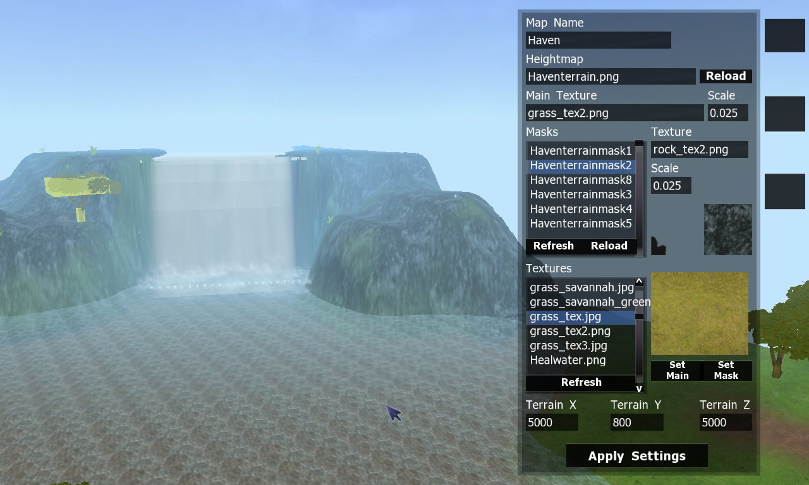
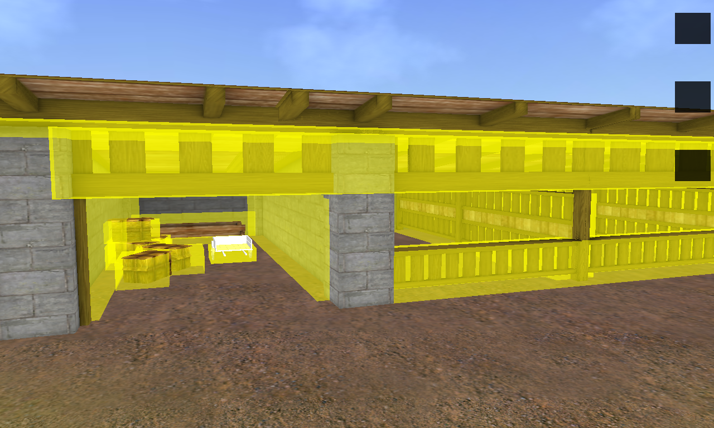
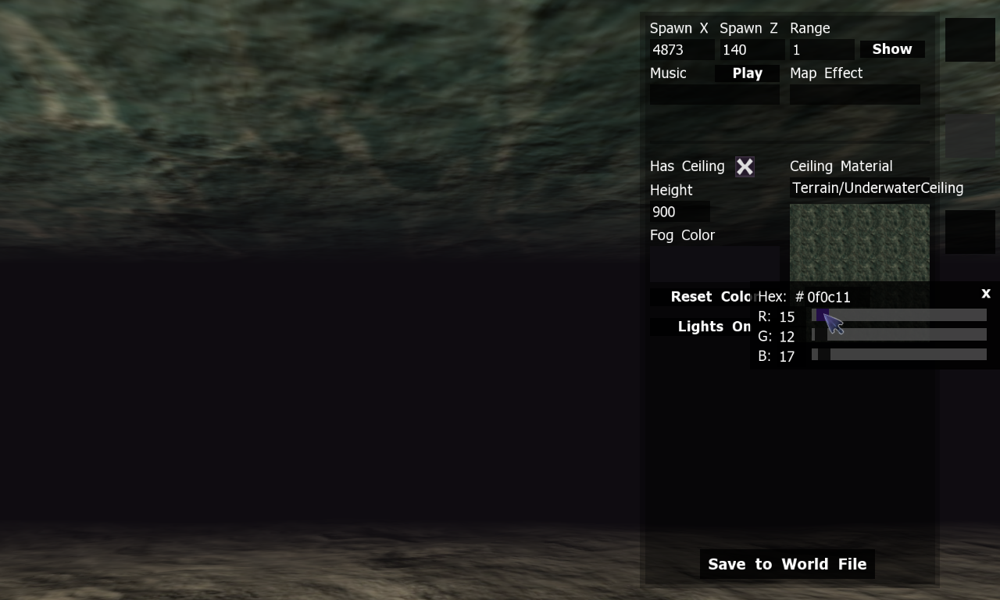
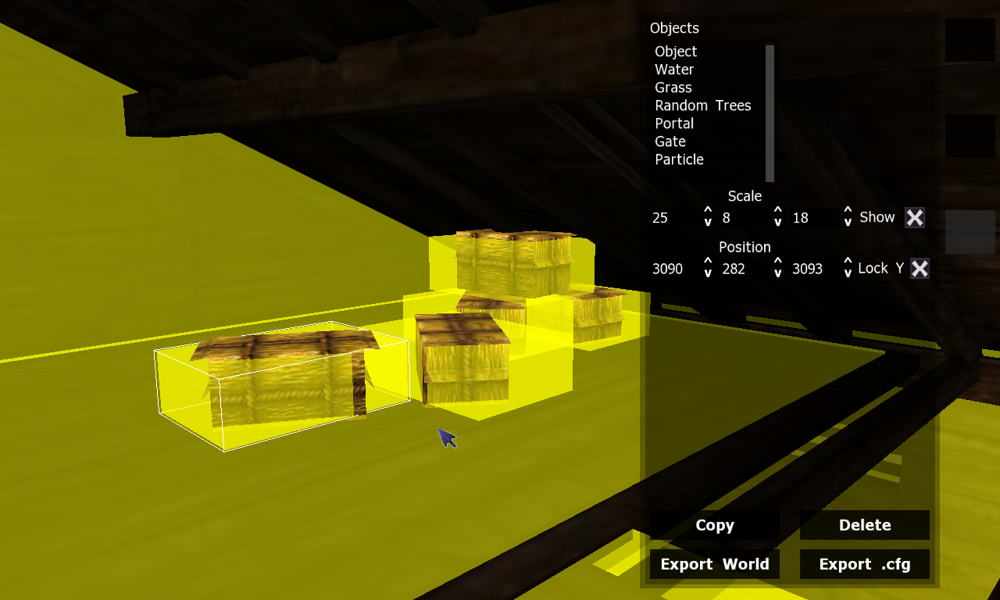
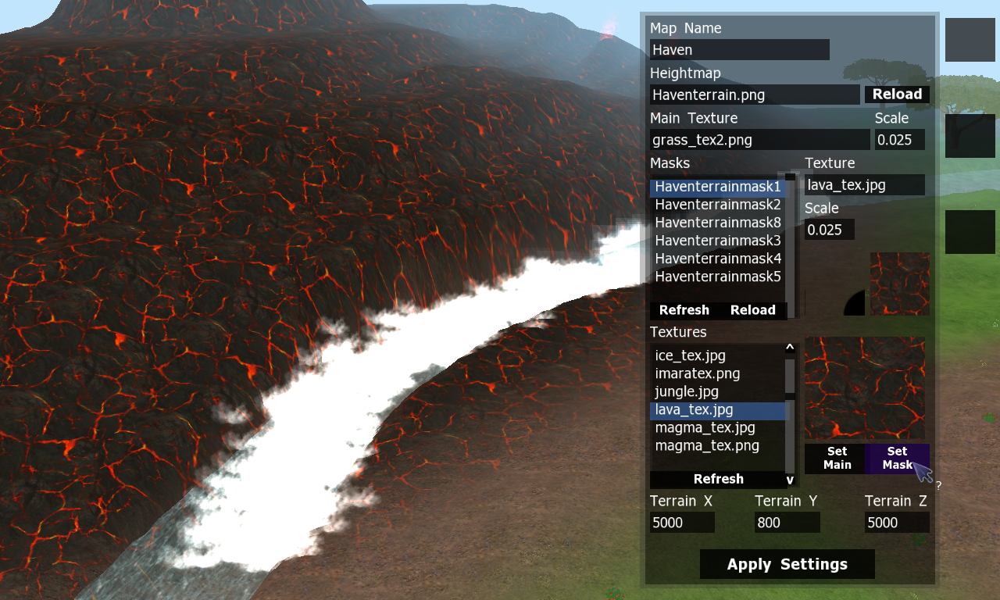
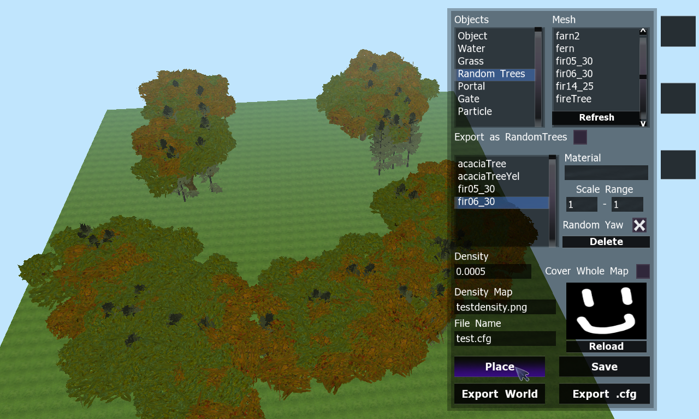
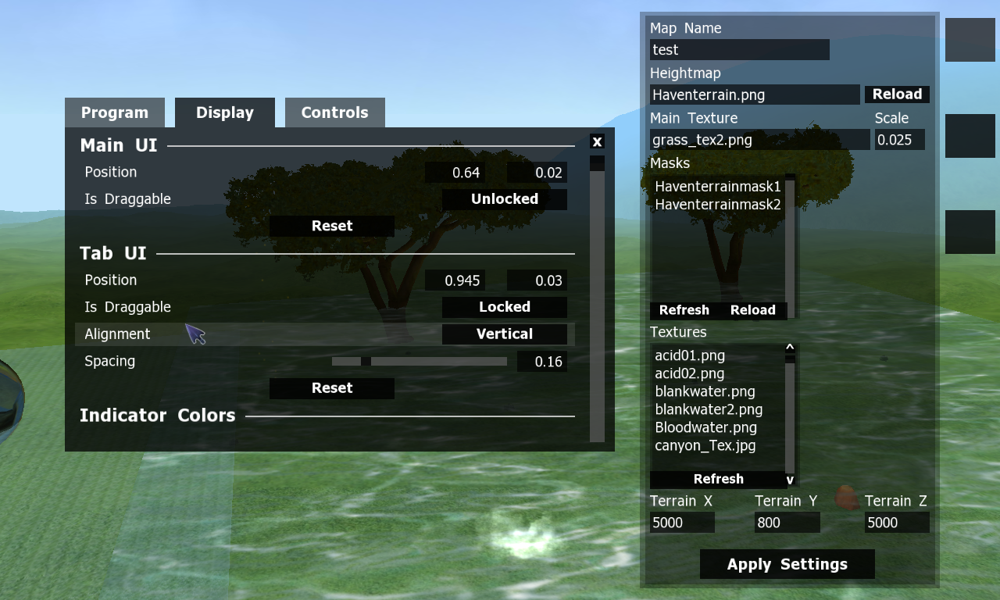
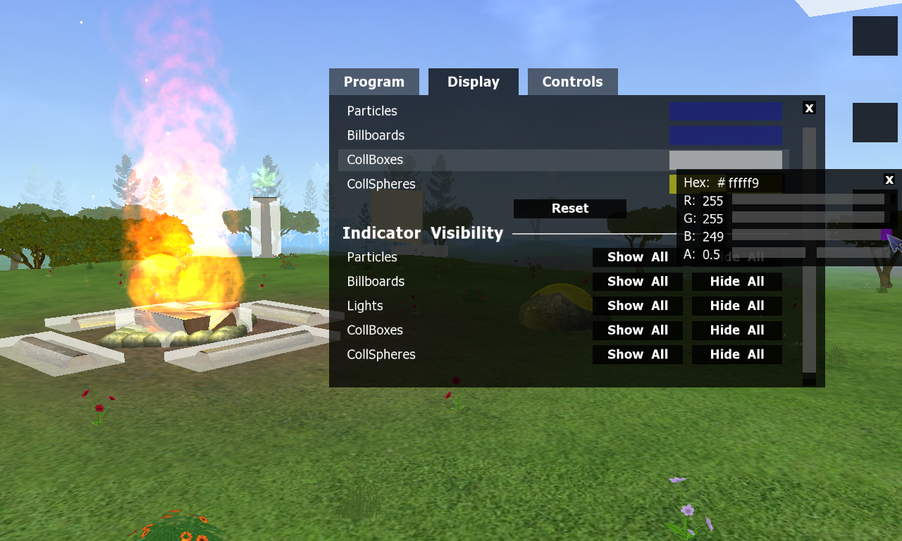
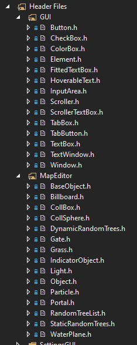

---

## Table of Contents

* TOC
{:toc}

---

## Impressive Title

> Impressive Title was an online animal chat sandbox inspired by The Lion King [...], with feline-like player models and tools that allowed the community to create their own custom made player textures (presets) and maps. [...] The original servers ran from 2008 until mid 2010 [...]
> In 2011, after Impressive Title had been closed down for about a year, [...] KovuLKD gave out the source code on his Facebook so that anyone could make their own Impressive Title servers. - <i>[Glasmar](https://glasmar.weebly.com/what-is-impressive-title.html)</i>

I got involved with Impressive Title ("IT") around 2013-14 when some friends and I decided to create our own "server," or fork of the source code. I wasn't originally in charge of programming, but an issue came up and I took the files to try to fix it. As I was looking through the code, I realized that the logic and syntax made sense to me, despite having never seen C++ before. I began tinkering with the code that day, and I haven't stopped programming since.

I began taking simple coding commissions, plugging in various premade codes to clients' unique IT servers, mainly as an outlet to write code and learn more. I progressed from basic copy/paste/edit features, such as new markings or body parts, to entire systems spanning multiple classes written from scratch, like a way to randomly assign an item color(s) when it spawns and dynamically create the necessary materials. The more I worked, the more I wanted to learn, and I was eager to break away from the repetition of the same source code with different modifications. Thankfully, a client approached me with a new project, separate from but directly related to Impressive Title, which I enthusiastically accepted.

---

## The Problem

Impressive Title is “affectionately” known to be a bit of a disaster, at least to those who work on it directly. The source code itself is not documented at all and a lot of the data structures are set up in a very strict and complicated way. One of the best examples of this is the map system: map environments are generated by reading in several files, the main one being the “.world” file. This is simply a text file with a .world extension that holds (almost) all of the map’s information, including its objects, settings, and name of its terrain file. Here is a simple example:

```
[Initialize]
MapTerrain.cfg
5000
5000
2500 2500 100

[WeatherCycle]
None

[Object]
acaciaTree.mesh
2538.16 335.373 1951.99
1 1 1
0 0 0
```

The format may be fairly clear (once you understand the position of the numbers), but consider a finished map:

<details><summary>Click me for lots of text!</summary>

<pre>
[Initialize]
Haventerrain.cfg
5000
5000
2570 1088 0
[WeatherCycle]
Petals
[Music]
GonnaStart.mp3
[Trees]
HavenTrees.cfg
[Bushes]
HavenFlowers.cfg
[Grass]
grass
Havengrassdensity.png
grass_tex2.png
[Portal]
4814 655 4786
25
Lava
[Portal]
239 645 4950
25
Waterfall
[Portal]
4820 835 69
25
Ascension Island
[Portal]
60 300 60
25
Forest
[Portal]
555 280 1960
25
Ranch
[Gate]
GateMatBlack
1875 200 3575
The Void
2010 2990 1955
[Portal]
3805 275 2345
25
ReallyBig
[WaterPlane]
4629.4 481 4676
1
1.2
Terrain/Magma
lava1.wav
false
1
[WaterPlane]
3200 213 2500
13
13
Terrain/LargeWater
water1.wav

[Object]
rectangleslab.mesh
420 606 4700
300 5 450
0 335 0
no sound
Wfall

[Particle]
Bonfire
4831.03 358.407 3478.85
fireloop.wav
0 0 0

[Particle]
Bonfire
4921.79 420.694 3820.91
fireloop.wav
0 0 0

[Particle]
Bonfire
3746.97 376.931 4947.91
fireloop.wav
0 0 0

[Particle]
Bonfire
3580.13 345.69 4922.56
fireloop.wav
0 0 0

[Particle]
WaterSplash
164.035 511.373 3589.87
0 0 0

[Particle]
WaterSplash
1280.94 511.373 4428.33
0 0 0

[Particle]
WaterSplash
50 617.663 3989.03
0 0 0

[Particle]
WaterSplash
1042.53 618.039 4896.3
0 0 0

[Object]
Waterfall.mesh
611 615 4245.2
3 1.3 2.75
0 152.5 0

[Particle]
WaterSplash
875.033 215 4217.38
water1.wav

[Particle]
WaterSplash
853.424 215 4205.36
water1.wav

[Particle]
WaterSplash
834.037 215 4195.71
water1.wav

[Particle]
WaterSplash
814 215 4184
water1.wav

[Particle]
WaterSplash
796 215 4173
water1.wav

[Particle]
WaterSplash
776 215 4162
water1.wav

[Particle]
WaterSplash
756 215 4151
water1.wav

[Particle]
WaterSplash
736 215 4140
water1.wav

[Particle]
WaterSplash
716 215 4129
water1.wav

[Particle]
WaterSplash
694 215 4118
water1.wav

[Particle]
WaterSplash
674 215 4107
water1.wav

[Particle]
WaterSplash
654 215 4096
water1.wav

[Particle]
WaterSplash
654 215 4096
water1.wav

[Particle]
WaterSplash
634 215 4085
water1.wav

[Particle]
WaterSplash
614 215 4074
water1.wav

[Particle]
WaterSplash
596 215 4063
water1.wav

[Particle]
WaterSplash
576 215 4052
water1.wav

[Particle]
WaterSplash
556 215 4041
water1.wav

[Particle]
WaterSplash
536 215 4030
water1.wav

[Particle]
WaterSplash
516 215 4019
water1.wav

[Particle]
WaterSplash
494 215 4008
water1.wav

[Particle]
WaterSplash
474 215 3997
water1.wav

[Particle]
WaterfallSmoke
875.033 215 4217.38
waterfall.mp3

[Particle]
WaterfallSmoke
834.037 215 4195.71
no sound

[Particle]
WaterfallSmoke
796 215 4173
no sound

[Particle]
WaterfallSmoke
756 215 4151
no sound

[Particle]
WaterfallSmoke
716 215 4129
no sound

[Particle]
WaterfallSmoke
674 215 4107
no sound

[Particle]
WaterfallSmoke
654 215 4096
no sound

[Particle]
WaterfallSmoke
614 215 4074
no sound

[Particle]
WaterfallSmoke
576 215 4052
no sound

[Particle]
WaterfallSmoke
536 215 4030
no sound

[Particle]
WaterfallSmoke
494 215 4008
no sound

[Particle]
Snowflake
4774.68 960 193.804

[Particle]
Snowflake
4950 960 50

[Particle]
Snowflake
4633.71 960 50

[Particle]
Snowflake
4950.777 950 238.081

[Object]
jbridge.mesh
740 220 2460
8 7 17
0 95 0
[CollSphere]
760 200 2460
38
[CollBox]
760 225 2460
220 5 50

[Particle]
Geyser
4673 481 4595

[Particle]
Steam
3677 213 4019
[Particle]
Steam
3605 213 4073
[Particle]
Steam
3535 213 4129
[Particle]
Steam
3753 213 3967
[Particle]
Steam
3849 213 3914
[Particle]
Steam
3918 213 3823
[Particle]
Steam
3998 213 3796
[Particle]
Steam
4075 213 3732
[Particle]
Steam
4160 213 3675
[Particle]
Steam
4147 213 3660
[Particle]
Steam
4228 213 3604
[Particle]
Steam
4262 213 3520
[Particle]
Steam
4283 213 3433
[Particle]
Steam
4282 213 3359

[Object]
den.mesh
80 292 80
20 20 20
0 50 0
[Object]
TangleWell.mesh
460 229 2198
5 5 5
0 0 0
[CollSphere]
460 268 2198
15

[Object]
woodsign.mesh
1073 430 4316
1 1 1
0 125 0

[Object]
log5.mesh
2560 360 2275
10 18 10
0 180 90
[Object]
log5.mesh
2560 355 2275
10 18 10
32 0 90
[Object]
log5.mesh
2560 360 2275
10 18 10
0 45 95
[Particle]
Bonfire
2560 370 2275
fireloop.wav
0 0 0
[Particle]
BonfireSpark
2560 370 2275
fireloop.wav
0 0 0
[Light]
2560 370 2275
1 0.85 0
[CollBox]
2560 350 2275
35 10 35

[Object]
log1.mesh
2605 350 2275
5 20 5
0 90 270
[CollBox]
2605 350 2275
20 4.5 55
[Object]
log1.mesh
2515 350 2275
5 20 5
0 90 270
[CollBox]
2515 350 2275
20 4.5 55
[Object]
log1.mesh
2560 350 2320
5 20 5
0 0 270
[CollBox]
2560 350 2320
55 4.5 20
[Object]
log1.mesh
2560 350 2230
5 20 5
0 0 270
[CollBox]
2560 350 2230
55 4.5 20

[CollBox]
2870 350 2015
20 61.5 20
[CollBox]
2255 340 2015
20 62 20
[CollBox]
2255 340 2750
20 62 20
[CollBox]
2870 340 2750
20 62 20
[Billboard]
2870 430 2015
40 40
AirCloud
[Billboard]
2255 420 2750
30 30
WaterDrop
[Billboard]
2255 420 2015
30 30
EarthLeaf
[Billboard]
2870 420 2750
30 30
FireFlame

[CollSphere]
2361 348 2178
18
[CollSphere]
2422 351 2585
18
[CollSphere]
2650 351 2456
18
[CollSphere]
2809 351 2474
18
[CollSphere]
2659 351 2168
18
[CollSphere]
2815 351 2076
18

[CollBox]
1033 436 4322
20 43 20
[CollBox]
1033 524 4322
150 45 150
[CollBox]
2446 247 3410
20 43 20
[CollBox]
2446 335 3410
150 45 150
[CollBox]
3061 241 1874
20 43 20
[CollBox]
3061 329 1874
150 45 150
[CollBox]
3709 238 2190
20 43 20
[CollBox]
3709 326 2190
150 45 150
[CollBox]
401 235 2289
20 43 20
[CollBox]
401 323 2289
150 45 150
[CollBox]
2237 348 2337
20 43 20
[CollBox]
2237 436 2337
150 45 150
[CollBox]
2349 348 2465
20 43 20
[CollBox]
2349 436 2465
150 45 150
[CollBox]
2503 342 2761
20 43 20
[CollBox]
2503 430 2761
150 45 150
[CollBox]
2830 351 2316
20 43 20
[CollBox]
2830 439 2316
150 45 150

[Object]
Cylinder.mesh
2395 250 4775
17 200 17
0 0 0
no sound
LaunchPad
[Gate]
GUIMat/invisible
2395 355 4775
Launch Room
500 280
[Object]
woodsign.mesh
2395 232 4720
1 1 1
0 180 0
no sound
warningskills

[Light]
2870 420 2750
1 0.85 0
250
[Light]
2870 430 2015
0.75 0.74 0.72
250
[Light]
2255 420 2750
0 1 0.74
250
[Light]
2255 420 2015
0 1 0.24
250

[HPBox]
2562 360 2275
40 40 40
-5
#
</pre>

</details>

Now you have lines and lines and lines of data, all written and entered by hand. And that's only the .world file; in this specific map, several hundred more objects are stored in two separate .cfg files. There were simple utilities to alleviate some of this, such as a basic “gardener” program that would randomly place trees within a specific range, but the brunt of the work fell on the person creating the map.

Another big issue was collision. The game does not have any kind of automatic collision detection; the only way to make an object solid is to manually place box and sphere areas, named CollBoxes and CollSpheres, that stop the user's movement. These boxes and spheres are internal objects, so they are never actually rendered in the world, meaning they are invisible to the user trying to place them. You had to rely soleley on the map coordinates, math calculations, and guesstimation to place accurate collision markers.

The sequel to Impressive Title, FeralHeart, has its own built-in mapmaker that lets you actively create and place objects then export a file of the proper type to add it ingame. Users would often create maps in this program then manually convert them to Impressive Title, as the formats were similar, but not exact. It was tedious, but still better than doing everything in IT. Collision, however, still had to be manually done, as FeralHeart used raycasting for accurate automatic collision detection.

---

## The Solution

Enter the Impressive Title MapMaker. It was inspired by the FeralHeart editor, and has similar functionality, though its code is completely separate. Its simple design allows users to enter map details and grab-and-place objects in an intuitive way, reducing the time and effort put into mapmaking significantly. Once they are finished, the program automatically exports their work into files readable by Impressive Title, allowing them to “plug and play” by copy/pasting the files to the proper location and running the game.

<details><summary>Screenshots</summary>
	








	
</details>

The program is currently released, though the stable version is very basic in design and functionality. Simply put, it works, but it isn’t always very fun to use (although still significantly better than the old method). Because of this, I have been working on a major Version 2 update for the last few months (April '22 - present) with several quality-of-life changes, as well as some major code refactoring to make my own life easier and, hopefully, the program more efficient. 

---

## Initial Release Features

### Terrain Features

- Set the size and height of the terrain
- Apply a heightmap and reload the image to see changes instantly
- Automatically generate a terrain material by adding and layering terrain masks

### Map Settings Features

- Set the map's default spawn point/range and view it with a visual indicator
- Ability to add Music, MapEffect, FreezeTime, and Weather map options
- Checkbox to add a ceiling to the map and set its material
- Option to turn on ambient light in maps with ceilings so it's easier to see

### Object Features

- The ability to add Objects, WaterPlanes, Grass, RandomTrees, Portals, Gates, Particles, Lights, Billboards, CollBoxes, and CollSpheres
- Placeable objects can all be directly picked up and dragged across the terrain to place them visually in real-time
- All object attributes can be directly edited via the UI (such as position, scale, rotation, material, etc)
- Particles, Lights, and Billboards have the option to show a visual indicator of their center
- CollBoxes and CollSpheres have visual indicators
- Includes a new random object generator that uses a black and white density map to scatter objects on terrain in specific areas

---

## New Version 2 Features

- CTRL+Z functionality to undo the last [x] object changes
- A brand new Settings box with its own design and functionality, all written from scratch
- Help Pop-Ups that show and give more detail if you hover certain elements
- [A temporary storage system that exports unsaved object changes to a file that can be recovered if the program crashes/closes unexpectedly]({{'mapmaker/tempstorage.html' | relative_url }})
- The ability to customize the UI position, tab spacing/alignment, indicator colors, and sensitivity of the up/down arrow buttons on object attributes
- The ability to customize the program’s keybinds
- A “Retry” button on File Not Found errors that reloads the resource group to capture any changes and tries the action again
- UI elements moved to their own individual classes
  - Added GUI namespace
  - Added Element base class that all element types derive from
- [Map objects moved to their own individual classes]({{'mapmaker/mapobjects.html' | relative_url }})
  - Added MapEditor namespace
  - Added BaseObject abstract base class that all objects derive from

In the above links are specific examples from select features that best showcase my programming abilities. The full source code is hosted in a [private repository](https://github.com/HunterWalden/IT-Mapmaker), but access can be granted upon request.

It is still in active development and its progress is tracked [on Trello](https://trello.com/b/6mFmDxG1/it-mapmaker).

---

# Coding Practices

---

## Encapsulation 

All GUI and Map objects are separated into their own classes for a clean, modular structure. All class member variables are protected and only changed or retreived via accessors/mutators and other public class functions. 



---

## Abstraction

All object functionality is contained inside its class; any action can be performed with a simple, concise function call.

<b>Object.cpp</b>

``` cpp
void Object::create(SceneManager* sceneMgr, const int& id, const Vector3& position)
{
	// Create entity and node
	mEntity = sceneMgr->createEntity(OBJECT_TYPE_NAME[mType] + StringConverter::toString(id), mMesh + ".mesh");
	mEntity->setQueryFlags(MOVABLEOBJECT_MASK);

	mNode = sceneMgr->getRootSceneNode()->createChildSceneNode(OBJECT_SCENENODE_PREFIX + StringConverter::toString(id));
	mNode->attachObject(mEntity);

	// Apply attributes
	mNode->setScale(mScale);

	// Translate PYR rotation
	if (mRotation.x != 0) mNode->pitch(Degree(mRotation.x));
	if (mRotation.y != 0) mNode->yaw(Degree(mRotation.y));
	if (mRotation.z != 0) mNode->roll(Degree(mRotation.z));

	// Apply material if exists
	if (!mMaterial.empty())
	{
		mEntity->setMaterialName(mMaterial);
	}

	// Set position
	setPosition(position);
}
```

<b>MapManager.cpp</b>

``` cpp
void MapManager::addObject(const String& meshName)
{
	// Create a new world object
	Object* tNewObject = new Object(meshName);

	// Create actual Object
	tNewObject->create(mSceneMgr, getNextAvailableID()); // << Object is created in the scene, we don't need to know how

	// Add to object list
	mPlacedObjects.push_back(tNewObject);

	// Set as current object
	setSelectedObject(mPlacedObjects.back());
	mIsPlacingObject = true;
}
```

---

## Inheritance

These object classes each have their own base class per-type that contains any shared attributes.  This cuts down on duplicate code and makes it easier to add new objects of each type.

For example, all Map Objects derive from BaseObject, as they all share the class member variables:

```cpp
class BaseObject
{
protected:

	// SceneNode of the object
	SceneNode* mNode;

	// Actual entity
	Entity* mEntity;

	// Type of object it is
	int mType;

	// If locked, the Y never changes; if unlocked, it snaps to the terrain height
	bool mLockY;
// ...etc
```

---

## Polymorphism

Map objects are polymorphic classes with an abstract BaseObject base class that controls them via the MapManager. Objects are all stored and accessed via BaseObject pointers, which are either cast if they need to access class-specific data:

```cpp
const String MapManager::getSelectedObjectMesh()
{
	return static_cast<Object*>(mSelectedObject)->getMesh(); // cast to Object since Mesh is unique to Objects
}
```

or called on the BaseObject and polymorphically checked for overrides:

```cpp
virtual void setPosition(const Vector3& position);

...

// All but CollBoxes pass their position directly to the SceneNode
void BaseObject::setPosition(const Vector3& position)
{
	mNode->setPosition(position);
}
```

```cpp
// CollBoxes use a different Y value, so it must use different position functions
void CollBox::setPosition(const Vector3& position)
{
	// Save passed Y
	mExportedY = position.y;

	// Set node position based on scale
	mNode->setPosition(position.x,
		mExportedY + (mScale.y / Real(2.0)),
		position.z);
}
```

```cpp
// mSelectedObject is a BaseObject pointer - if it's a CollBox, it'll use the proper function
mSelectedObject->setPosition(mPosition);
```
